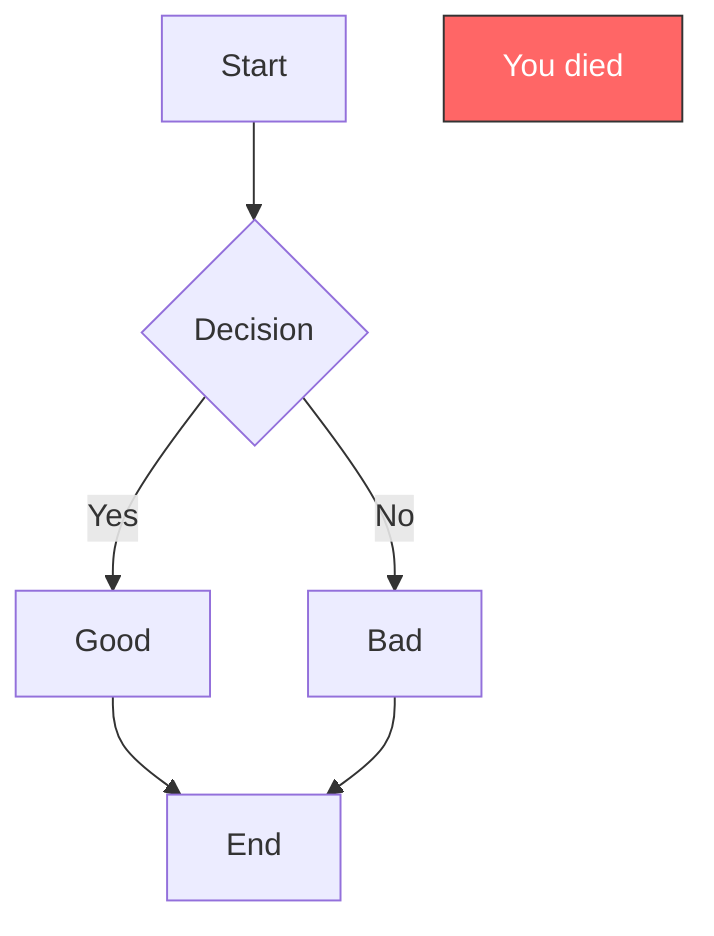
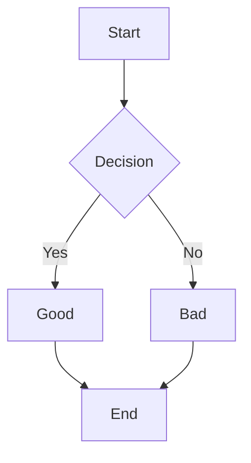
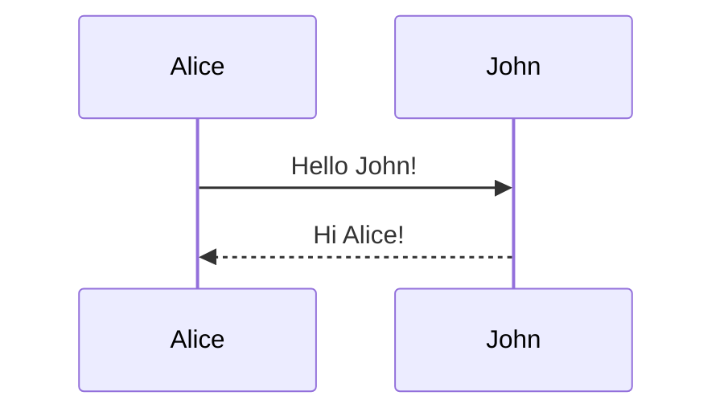
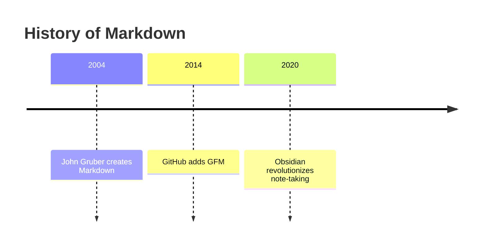

# پروژه نمونه

این فایل یک الگوی کامل برای نوشتن پروژه‌ها در قالب Markdown است.

## Overview

در این بخش خلاصه‌ای از پروژه، مسئله‌ای که حل می‌کند و ارزش افزوده آن نوشته می‌شود.

## Features

- عملکرد سریع و پایدار
- طراحی واکنش‌گرا
- تست‌های واحد و یکپارچه
- استقرار آسان روی Cloudflare

## Technologies

| نام | کاربری |
|:----|:-------|
| React | رابط کاربری |
| TypeScript | ایمنی نوع |
| Vite | ابزار توسعه |
| Tailwind CSS | استایل |

## Outcomes

| معیار | مقدار |
|:------|:------|
| Performance | 95+ |
| Accessibility | 100 |
| SEO | 100 |

## Architecture

```mermaid
graph TD
  Client[React App] --> Router[Cloudflare Worker SPA]
  Router --> Static[Static Assets (dist)]
  Client --> API[(API)]
```

## Math

$$
E = mc^2
$$

## Callout

[!warning]
برای مسیرها از `BrowserRouter` استفاده کنید تا URLها قابل سئو باشند.

## Gallery


## Links

[نمایش دمو](https://example.com/demo) • [کد منبع](https://github.com/memarzade-dev/example-project)

## Conclusion

این الگو تمام اجزای مورد نیاز را نشان می‌دهد. فیلدهای Front Matter شامل `title`, `description`, `date`, `tags`, `image`, `demoUrl`, `githubUrl` هستند و بدنه با `MarkdownRenderer` نمایش داده می‌شود.

## Headings

```markdown
# H1 - Main title
## H2 - Major section
### H3 - Sub-section
#### H4
##### H5
###### H6
```

GitHub automatically generates a table of contents when you use 2+ headings.

## Paragraphs & Line Breaks

```markdown
Regular paragraph (single enter does nothing).

Two spaces at end of line  
force a line break.

Empty line = new paragraph.
```

## Text Styling

| Style              | Syntax                          | Keyboard Shortcut         | Example                     | Rendered                     |
|-------------------|----------------------------------|---------------------------|-----------------------------|------------------------------|
| Bold              | `**text**` or `__text__`         | Cmd/Ctrl+B                | **Bold text**               | **Bold text**                |
| Italic            | `*text*` or `_text_`             | Cmd/Ctrl+I                | *Italic text*               | *Italic text*                |
| 
| Bold + Italic     | `***text***`                     | —                         | ***Bold italic***           | ***Bold italic***            |
| Strikethrough     | `~~text~~`                       | —                         | ~~Strikethrough~~           | ~~Strikethrough~~           |
| Subscript         | `<sub>text</sub>` or `~text~`    | —                         | H~2~O                      | H₂O                          |
| Superscript       | `<sup>text</sup>` or `^text^`    | —                         | X^2^                        | X²                           |
| Highlight       | `==highlighted==` (Obsidian)     | —                         | ==important==               | ==important==                |

## Quotes (Blockquotes)

```markdown
> Single level quote
>
> > Nested quote
> >
> > > Deeply nested
```

> Single level quote
>
> > Nested quote
> >
> > > Deeply nested

## Lists

### Unordered Lists
```markdown
- Item
  - Sub-item
    - Sub-sub-item
* Also works with asterisks
+ Or plus signs
```

### Ordered Lists
```markdown
1. First
2. Second
3. Third
   4. Sub-ordered
   5. Continues automatically
```

### Task Lists (GitHub + Obsidian)
```markdown
- [x] Completed task
- [ ] Incomplete task
- [ ] Another one
```

- [x] Completed task  
- [ ] Incomplete task  
- [ ] Another one

## Code

### Inline Code
```markdown
Use `git status` to check changes.
```

### Code Blocks
```markdown
```javascript
console.log("Hello Markdown");
```

```python
def hello():
    print("World")
```

```diff
+ Added
- Removed
```

```bash
$ npm install markdown-cheatsheet
```
````

## Tables (GitHub Flavored Markdown)

```markdown
| Left | Center | Right | Default |
|:-----|:------:|------:|---------|
| A    |   B    |   C   | D       |
|  | E     |

| Name       | Syntax                    | Example                     |
|------------|---------------------------|-----------------------------|
| Bold       | `**text**`               | **bold**                    |
| Link       | `[text](url)`             | [GitHub](https://github.com) |
```

| Left | Center | Right | Default |
|:-----|:------:|------:|---------|
| A    |   B    |   C   | D       |  | E     |

## Links

```markdown
[GitHub](https://github.com)
[With title](https://github.com "GitHub Homepage")

Automatic! https://github.com

Reference style:
[Obsidian][1]

[1]: https://obsidian.md
```

## Images

```markdown


<!-- Obsidian embed -->
![[image.png]]
![[image.png|400]]
![[image.png|Inline embed]]
```

## Horizontal Rules

```markdown
---
***
___
```

---

## Escaping Characters

Use backslash to display literal characters:

```markdown
\*literal asterisks\*
\`backtick\`
\# Not a heading
```

## Emoji

```markdown
:smile: :rocket: :fire: :tada: :+1: :-1: :heart:
```

Obsidian and GitHub support hundreds of emojis!

## Footnotes

```markdown
Here is a footnote reference[^1].

[^1]: This is the footnote content.
```

Here is a footnote reference[^1].

[^1]: This is the footnote content.

## Definition Lists (GFM doesn't support natively, but Obsidian does)

```markdown
term
: definition
: another definition
```

## Abbreviations (Obsidian)

```markdown
*[HTML]: Hyper Text Markup Language
*[GFM]: GitHub Flavored Markdown

The HTML specification is maintained by the W3C.
```

## LaTeX Math (GitHub + Obsidian)

### Inline: `$x^2$`
### Block:
```latex
$$
\begin{bmatrix}
a & b \\
c & d
\end{bmatrix}
= ad - bc
$$
```

$$ \int_{0}^{\infty} e^{-x^2} dx = \frac{\sqrt{\pi}}{2} $$

## Mermaid Diagrams (Obsidian + GitHub)

```markdown

````



### Sequence Diagram


### Timeline (Obsidian)


## Callouts / Admonitions (Obsidian)

```markdown
> [!note]
> This is a note

> [!tip] Pro Tip
> Use callouts wisely

> [!warning]
> Careful now

> [!danger]
> This will explode

> [!quote]
> "Be the Markdown you wish to see in the world"
```

> [!note]
> This is a note

> [!tip] Pro Tip
> Use callouts wisely

## Embed Files (Obsidian)

```markdown
![[document.pdf]]
![[image.jpg|400]]
![[note.md]]
![[note.md#Heading]]
![[note.md#^block-id]]
```

## Comments (invisible in render)
```markdown
[//]: # (This is a hidden comment)
```

## Details / Collapsible Sections (GitHub + Obsidian)

```markdown
<details>
<summary>Click to expand</summary>

Hidden content here!

</details>
```

<details>
<summary>Click to expand</summary>

Hidden content here!

</details>

## Highlight / Mark

```markdown
==This text is highlighted== (Obsidian)
<mark>Marked text</mark> (HTML)
```

## Keyboard Keys

```markdown
<kbd>Ctrl</kbd> + <kbd>C</kbd>
```

<kbd>Ctrl</kbd> + <kbd>C</kbd>

## GitHub-Specific Features

### Task Lists in Issues/PRs
```markdown
- [x] Write cheatsheet
- [ ] Publish it
```

### Automatic Linking
```
Fixes #123
Closes #456
Resolves adam-p/markdown-here#789
```

### Emoji Reactions & Mentions
```
@github/awesome-user :+1:
```

### Strikethrough in Tables
```markdown
| Feature     | Status     |
|-------------|------------|
| Markdown    | ~~No~~ Yes |
```

## Obsidian-Specific Extensions

### Internal Links
```markdown
[[Internal Link]]
[[Link with alias|Display Text]]
[[Link#Heading|Heading]]
[[Link#^block-id|Block]]
[[Link|With emoji]]
```

### Tags
```markdown
#tag #nested/tag #project/markdown
```

### Properties / Frontmatter
```yaml
---
title: My Note
tags: [markdown, cheatsheet]
date: 2025-12-02
status: published
aliases: [md-cheat, markdown-ref]
---
```

### Transclusion / Embeds
```markdown
![[Another Note#Section Title]]

> [!quote] From another note
> ![[Wisdom Note#^famous-quote]]
```

### Canvas Embeds
```markdown
![[My Canvas.canvas]]
```

## Miscellaneous & Everything Mentioned Even Once

- GitHub supports GeoJSON maps in gists
- Obsidian supports `.canvas`, `.base` files
- Obsidian has "Bases" — database-like views with filters, sorts, formulas
- Saved Replies in GitHub for reusable responses
- Web Viewer plugin in Obsidian with reader mode
- Word count plugin shows CJK support
- 2FA recovery codes must be saved
- Anonymous gists cannot be deleted
- You can pin gists to your GitHub profile
- Obsidian supports audio/video embedding with device codec limitations
- `publish.js` for custom analytics in Obsidian Publish
- Workspaces plugin saves entire layouts
- MathJax supports full TeX packages in both platforms

**Closing signature**  
Written with love by memarzade-dev — ۲ آذر ۱۴۰۴ | December 02, 2025 @ 23:59 UTC
